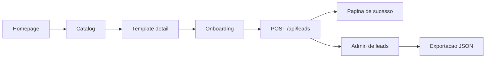

# Uxpress Documentation Hub

Welcome to the Uxpress documentation hub, covering a marketplace for premium website templates and complete website kits for coaches, consultants, mentors, freelancers, and service businesses.

## Start here

- [Project overview](./PROJECT_OVERVIEW.md) - product, primary flows, and current MVP boundaries.
- [Portfolio website objective](./PORTFOLIO_OBJECTIVE.md) - objective, primary conversion, metrics, and non-goals.
- [Local development](./LOCAL_DEVELOPMENT.md) - how to install dependencies, run, and validate the project.
- [Content guide](./CONTENT_GUIDE.md) - where to edit homepage content and add templates.

## Product and operations

- [Lead management](./LEAD_MANAGEMENT.md) - storage, API, admin area, and export.
- [Deployment](./DEPLOYMENT.md) - recommended configuration for publishing to Vercel.
- [CI/CD](./CI_CD.md) - automated validation and integration workflow.

## Quick project map

| Area | Location | Responsibility |
|---|---|---|
| Homepage | [`app/page.tsx`](../app/page.tsx) | Product presentation and initial conversion |
| Catalog | [`app/templates/page.tsx`](../app/templates/page.tsx) | Template listing and filtering |
| Details | [`app/templates/[slug]/page.tsx`](../app/templates/%5Bslug%5D/page.tsx) | Offer, features, and CTA for each template |
| Onboarding | [`app/start/page.tsx`](../app/start/page.tsx) | Collection of prospective customer information |
| Form | [`components/start/StartForm.tsx`](../components/start/StartForm.tsx) | Lead submission to the API |
| Lead API | [`app/api/leads/route.ts`](../app/api/leads/route.ts) | Lead intake and validation |
| Admin | [`app/admin/leads/page.tsx`](../app/admin/leads/page.tsx) | Review of captured leads |
| Template data | [`lib/templates.ts`](../lib/templates.ts) | Catalog, pricing, features, and FAQs |
| Homepage data | [`lib/homepage.ts`](../lib/homepage.ts) | Benefits, statistics, steps, and testimonials |
| MVP persistence | [`lib/leads.ts`](../lib/leads.ts) | JSON reading and writing |

## Primary flow



## Essential commands

```bash
npm install
npm run dev
npm run typecheck
npm run lint
npm run build
```

The local application is available at `http://localhost:3000`.

## Environment variables

Copy the example file before configuring real links:

```bash
cp .env.example .env.local
```

Main variables:

- `NEXT_PUBLIC_SITE_URL`
- `NEXT_PUBLIC_LEMON_SQUEEZY_BUSINESS_COACH_URL`
- `NEXT_PUBLIC_LEMON_SQUEEZY_EXECUTIVE_CONSULTANT_URL`
- `NEXT_PUBLIC_LEMON_SQUEEZY_PERSONAL_BRAND_URL`
- `NEXT_PUBLIC_TALLY_INSTALLATION_FORM_URL`
- `CONTACT_FORM_ENDPOINT`

## Current MVP boundaries

The MVP includes marketing pages, a template catalog, template details, lead capture, local storage, admin review, export, and CI validation.

It does not yet include authentication, a production database, configured payments, a CMS, a visual editor, a drag-and-drop builder, or email automation.

For production, the recommended priority is to replace `data/leads.json` storage with a database, add authentication to the admin area, and configure notifications for new leads.
